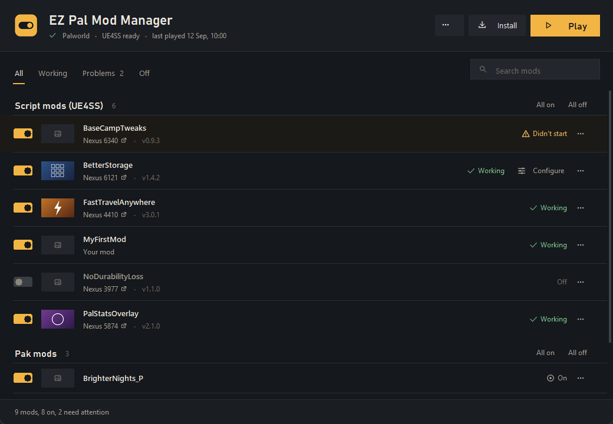
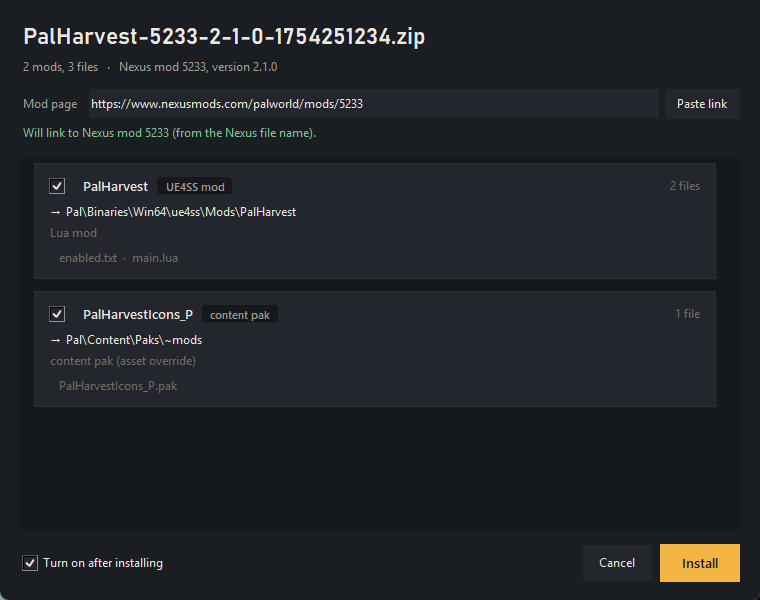
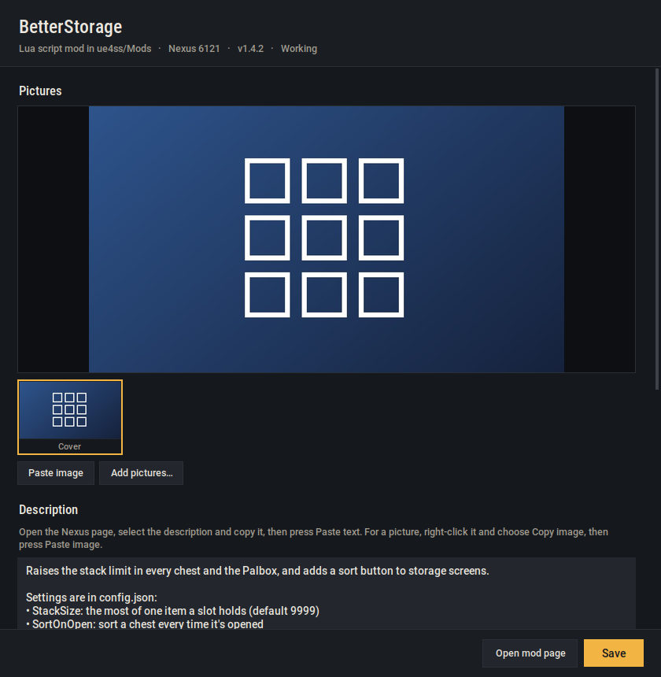

# EZ Pal Mod Manager

Install Palworld mods, turn them on and off, and find out why one isn't working.

Most mod managers can put files in a folder. The hard part with Palworld is that
there are four folders a mod can belong in, nothing tells you when a mod is in
the wrong one, and a mod that fails to load fails silently. This reads the
contents of every `.pak`, cross-references what UE4SS actually loaded last run,
and says which of those two things went wrong.



Windows, no install, no dependencies. Download the zip from
[Releases](https://github.com/Hahnter/EZ-Pal-Mod-Manager/releases), extract it
into your Palworld folder (the one with `Palworld.exe`) or anywhere else, and run
`EZPalModManager.exe`.

The exe isn't code-signed, so Windows SmartScreen may say it's from an unknown
publisher (click *More info*, then *Run anyway*). Each release lists the zip's
SHA-256 so you can check your download, and you can build the exe yourself from
this source instead; see *Building from source* below.

## What it does

**Finds your game.** Every Steam library, Xbox Game Pass, dedicated servers, and
the usual loose locations. If it guesses wrong, pick from the list or browse. Browsing to `Win64`, `Paks`, or the Steam
library root resolves to the right place anyway. Several installs (say, the game and a server) can be switched
between from **… → Switch install**.

**Knows whether UE4SS is there, and installs it.** Missing, broken (UE4SS.dll
without its `dwmapi.dll` proxy), two copies fighting, the old flat 3.0.1
layout, or a missing `MemberVariableLayout.ini`. Each of those gets a banner
saying what it means. Where the answer is "you need the Palworld build of UE4SS",
**Install UE4SS** fetches it from Okaetsu's own GitHub releases and puts it in
place, keeping whatever was there as `ue4ss.pmm-old-<date>`. Your mods carry
over to the new one with their settings and stay on or off as they were.
**Install PalSchema** does the same for PalSchema. Both windows show the release, file
name, size and source before anything is downloaded, and nothing is fetched
until you press the button. This is the only part of the app that uses the
network; see *Privacy and security* below. Pak mods are still managed without UE4SS; they don't need it.

**Installs mods.** Point it at a `.zip`, `.7z`, `.rar`, a folder, or a bare
`.pak`. It reads what's inside, works out where each piece goes, and shows you
that before writing anything:

```
PalHarvest-5233-2-1-0.zip        3 items, 4 files · Nexus mod 5233, v2.1.0

  ☑  PalHarvest         UE4SS mod       → Pal\Binaries\Win64\ue4ss\Mods\PalHarvest
  ☑  PalHarvestBP_P     blueprint pak   → Pal\Content\Paks\LogicMods
  ☑  PalHarvestIcons_P  content pak     → Pal\Content\Paks\~mods
```



One archive often holds several mods; each one can be left out. Existing files
are backed up as `.pmm-bak` rather than overwritten. You can pick several
downloads at once, or drop them onto the `.exe`; they open one after another.

**Links back to where you got it.** The install window has an optional *Mod
page* field. Nexus downloads fill it in themselves, since their file names
carry the mod ID. For a CurseForge zip, copy the page address from your
browser and press *Paste link*; if a Nexus or CurseForge address is already on
your clipboard, the window points that out. When you update a mod from a newer
zip, the link you added last time is kept. The link is stored locally, and the
app never visits the page.

**Remembers where mods came from.** Each mod's row shows where it came from,
and clicking that opens its page. Nexus downloads fill themselves in, because their
filenames encode the mod id, version and release date. The only mods you ever
type details for are the ones you got some other way.

**Shows what each mod is.** Click a mod's name to open its info: a picture
gallery, a description, and where it came from. Mods with a picture get a
thumbnail in the list, and search looks inside descriptions too.



The app never downloads anything from Nexus or CurseForge. Both sites' terms
forbid tools that read their pages (Nexus terms §11, Overwolf/CurseForge §3),
so the information arrives the way you'd move it yourself:

- **From the mod page.** *Open mod page*, copy the description, press *Paste
  text*. Right-click a picture, choose *Copy image*, press *Paste image* (or
  Ctrl+V anywhere in the window).
- **From the download.** A README or pictures packed in the archive become the
  description and gallery automatically when you install.
- **From your own files.** *Add pictures…* takes PNG, JPEG, WebP, GIF or BMP.
  Pictures are stored rotated upright and at most 1920 px, so the store stays
  small.
- **From the mod's folder.** A README or `preview.png` already in the folder is
  offered with one click.

Pasting a mod's page address fills in the source and mod ID from the link
itself; the page isn't opened.

For your own mods, what you write and add here goes into *Package for
sharing*: the description as `DESCRIPTION.md` and the pictures under
`images/`, with the cover as `preview`, ready to upload. When someone installs
that package with this app, they get the same description and pictures.

**Keeps your settings when a mod updates.** Install a newer version of a mod
you've configured and your settings file stays as you left it; the new one
lands beside it as `<name>.new` so you can see what changed. The app records
what each mod shipped, so it can tell your edits from the mod's own defaults.
A file you never touched is just replaced.

**Uninstalls cleanly.** Every file an install writes is recorded, so removal
takes exactly those files and nothing else. Mods installed before this app fall
back to deleting their own folder or pak, and it tells you that first.

**Makes mods.** *New mod* scaffolds a working UE4SS Lua mod, switched on and
ready to edit. *Package for sharing* zips it laid out to extract into any
Palworld install, the way Nexus mods ship.

**Explains failures.** Load errors are translated. A DLL rejected with `0x7f`
becomes *built against a different UE4SS ABI*. Paks whose contents say they
belong in the other folder are flagged. Mods old enough to predate the current
game build are noted.

**Configures mods.** Any mod shipping a config file gets real controls per
setting. `ini`/`txt`/`cfg` files are edited line by line so comments and
formatting survive; `json` is edited structurally; `lua` configs are code and
open in your editor instead. Every save writes a `.bak` first.

**Profiles.** Save the current set of enabled mods under a name (a modded solo
set, a near-vanilla one for multiplayer) and switch between them. Loading a
profile stages the changes so you can look before applying.

## Keeping a working setup working

**Play.** Starts the game (or server) through Steam. When it closes, the app
rescans and shows what happened: what loaded, what failed and why, what was on
but never started. Sessions started from Steam directly are noticed too.

**Save backups.** The first time you press Play with a mod setup you haven't
played before, your `SaveGames` folder is copied first. **… → Save backups**
restores any of them in one click, and backs up what's there now before doing
so, so a restore can itself be undone. The last ten automatic backups are kept.

**Game updates.** The app remembers the Steam build each mod was last seen
loading on. After a patch you get *"Palworld updated to build X since your mods
last ran, 6 mods haven't loaded on this build yet"*. Play once, and any mod
that worked before the patch but not after is called out by name.

**File conflicts.** Two paks that replace the same asset can't both win. The
app reads every pak's index, finds the overlaps, and says which one wins: a
pak ending in `_P` always beats one that doesn't; between two `_P` paks the
name that sorts last is normally read first, so that result is shown as
*likely*. Content paks missing the `_P` suffix are flagged too, Unreal ranks
them below the game's own files, so they usually can't replace anything.

**Core blueprints.** A pak that replaces the player character, controller,
state or game mode is flagged. Those mods carry a whole copy of something the
game updates, which is why they break or crash after a patch, and two of them
can never work together.

**Hotkeys.** Mods declare keys in three different places, `RegisterKeyBind`
calls, `config.lua` tables, and `[keys]` sections of `.ini` files, and the app
reads all three. Two enabled mods on the same key are flagged on both rows.
Mods that build their keys in code are listed as unreadable rather than assumed
to be fine.

## Privacy and security

**Nothing leaves your PC.** No account, no telemetry, no analytics. Everything
the app records (sources, links, pictures, descriptions, receipts, backups)
stays in `%LOCALAPPDATA%\PalModManager`. The one exception is **Install
UE4SS / PalSchema**: when you press it, the app asks GitHub for the current
release and downloads it, and that request carries no information about you
beyond what any download does.

**Files from strangers are handled as such.**

- Archives can't write outside the folder they're unpacked into, and one that
  would unpack to more than 8 GB, hold more than 20,000 files, or inflate a
  file a thousand times over (a zip bomb) is refused before it is opened.
  What 7-Zip unpacks is checked afterwards rather than trusted, including for
  links pointing elsewhere on disk.
- Downloads only ever come from GitHub over HTTPS, redirects included, and
  are checked against the SHA-256 GitHub publishes for each release file.
- Links only open if they are web pages. A mod page link that is really a
  program path, a `file://` address or a custom protocol is refused.
- Pictures are re-encoded when added, which strips camera and GPS data,
  XMP and C2PA provenance tags, AI generator prompts stored in PNG text, and
  JPEG comments. A picture declaring an absurd size is refused.
- The source is checked in the tests for invisible Unicode characters
  (zero-width, bidi, tag characters and the like), the kind watermarking
  tools hide in text.

## Tools

All under **…**:

- **UE4SS log**: the log live, filtered to mod lines or just problems. UE4SS
  writes hundreds of engine offsets at startup (`ArIsError = 0x29`) that look
  like errors and aren't; those are hidden.
- **Conflicts & hotkeys**: every file conflict and key clash in one place,
  with a jump to the config that sets each key.
- **Blueprint load order**: edits BPModLoaderMod's `load_order.txt` with two
  lists instead of hand-typed pak names.
- **Clean up leftovers**: configs for mods that are gone, orphaned `.ucas`/
  `.utoc` files, empty mod folders, and UE4SS copies parked by Repair.
  Everything goes to the Recycle Bin.
- **Share modlist**: copy your enabled mods as text for Discord, export them
  to a file, or open a friend's file to see what you're missing (with links),
  what you have switched off, and what you run that they don't. *Match their
  setup* stages the on/off changes for you to apply.

**PalSchema mods** get their own group. PalSchema has no enable flag, so a mod
is switched off by moving its folder from `PalSchema\mods` to
`PalSchema\disabled-mods`, where PalSchema doesn't look.

## Reading the list

| State | Means |
|---|---|
| **working** | Confirmed in `UE4SS.log`: it started last time you played. |
| **worked before update** | It started, but on the game version before the latest patch. Play once to confirm it still does. |
| **didn't start** | Switched on, but the last session never started it. |
| **error** | It tried to start and failed; the reason is on the row. |
| **off** | Switched off. Won't load next launch. |
| **on** | A pak mod that's switched on. Pak mods never write to the log, so whether it works can only be seen in game. |
| **wrong folder** | The pak's own contents say it belongs in another folder; the row says which. |
| **needs PalSchema** / **PalSchema off** | A PalSchema mod whose framework isn't installed or switched on. |

Rows keep to the essentials: the switch, the name, a link to the mod's page
when there is one, and its state. The mod's type, folder and version are in its
info window (click the name). Notes under a row are coloured by weight: red for
something that stops the mod working, amber for a clash worth knowing about,
grey for information.

A switch drawn as an amber outline is a change you haven't applied yet.
**Apply changes** and **Undo** appear at the bottom whenever there is one.

Everyday actions are in the **…** menu (profiles, save backups, sharing,
folders); the specialist ones (conflicts, UE4SS log, load order, cleanup) are
under **… → Tools**.

Changes apply **on the next launch**. UE4SS loads mods once at startup, so
nothing can be hot-swapped, which is the whole reason this is a desktop app
rather than an in-game menu.

## Command line

Everything the app does, scriptable:

```bash
python palmods.py status                    # the full report
python palmods.py status --html             # also write dashboard.html
python palmods.py install <archive> -y      # install without prompting
python palmods.py install <zip> --link URL  # ...and link it to its mod page
python palmods.py uninstall <name>          # remove a mod
python palmods.py enable  <name>            # toggle
python palmods.py disable <name>
python palmods.py new <name>                # scaffold a mod of your own
python palmods.py path --detect             # list every install found
python palmods.py path --set <folder>       # point at one
python palmods.py source <name> --set-source Nexus --id 3915
python palmods.py profile save modded       # save / load / list / delete
python palmods.py doctor --fix              # repair a conflicting UE4SS
python palmods.py check                     # UE4SS, updates, conflicts, hotkeys, leftovers
python palmods.py backup create             # back up saves; also: list, restore <id>
python palmods.py export --text             # your modlist, ready to paste
```

## Doctor

The CurseForge app reinstalls the flat-layout UE4SS 3.0.1 over the top of the
experimental build, which silently reverts every Nexus mod that needs the newer
one. The symptom is mods quietly not loading and `UE4SS.log` reappearing in
`Win64\`. `doctor` detects that, rescues any mods stranded in the wrong root,
and parks the stray files.

The DLL checksum part of that check needs a known-good `dwmapi.dll` to compare
against, which isn't shipped, because it's UE4SS's binary rather than ours. Put one in
`%LOCALAPPDATA%\PalModManager\reference\` to enable it; everything else in
`doctor` works without it.

## Where things are kept

Everything this tool generates lives in `%LOCALAPPDATA%\PalModManager`:

| File | What |
|---|---|
| `settings.json` | Game folder and preferences |
| `registry.json` | Per-mod source, id, version, notes |
| `receipts.json` | What each install wrote, for clean removal |
| `profiles.json` | Saved sets of enabled mods |
| `manifest.json` | Regenerated each scan; the in-game panel reads this |
| `state.json` | Which build each mod last loaded on, per install |
| `error.log` | Details of anything that went wrong, if anything has |
| `backups\` | Save-game backups, one folder per install |
| `media\` | Mod pictures and their thumbnails, one folder per mod |

Nothing is written next to the program. The release is a one-file build, and
that folder is a temp directory deleted when the app closes.

Settings, the registry, receipts, profiles and state are never edited in
place. Each save is written to a new file and swapped in whole, so a crash or a
power cut can't leave half a file behind, and the version before is kept as
`<name>.bak`. A file that won't read is never written over: it's kept as
`<name>.corrupt-<time>` and the `.bak` takes its place. UE4SS's `mods.txt` and
`mods.json` are saved the same way when you switch a mod on or off.

When something goes wrong in the app itself, it says so and writes the details
to `error.log`. *Copy details* puts them on the clipboard for a bug report. In
both, your home folder appears as `%USERPROFILE%`, so your Windows user name
stays out of anything you share.

## The in-game panel

An optional read-only UMG panel, F8 in game, listing what's installed. It exists
because UE4SS Lua can open a file but cannot enumerate a directory, so it reads
`modlist.txt`, which the desktop app rewrites on every scan. Toggling isn't
offered there because it could never apply before the next launch anyway.

## Layout

| File | |
|---|---|
| `palmods_gui.py` | The app |
| `palmods.py` | Scanning, log parsing, pak reading, toggling, config editing |
| `palpaths.py` | Finding Palworld; settings and data locations |
| `palinstall.py` | Archive inspection, install, uninstall, scaffolding |
| `palregistry.py` | Mod sources, install receipts, profiles |
| `palsafety.py` | Build tracking, pak conflicts, hotkeys, save backups, launching |
| `paltools.py` | Leftovers, load order, modlists, log classification |
| `palwindows.py` | Log, conflicts, load order, backups, cleanup, compare, session windows |
| `palui.py` | Shared palette, fonts and widgets (switch, buttons, themed scrollbar) |
| `palicons.py` | Icons and the app mark, drawn in code; no image files |
| `paltext.py` | Wording helpers (`plural`) |
| `palget.py` | Downloading UE4SS and PalSchema from their GitHub releases |
| `palmedia.py` | Mod descriptions and pictures: clipboard, files, archives, links |
| `palinfo.py` | The mod info window and picture viewer |
| `ingame/` | The in-game Lua panel |
| `package.py` | Builds the release zip |

## Building from source

Windows only. Developed and tested on Python 3.14.

```bash
pip install -r requirements.txt
python palmods_gui.py
```

That runs the app straight from source. To build the exe and the release zip:

```bash
python -m PyInstaller build/PalModManager.spec --distpath dist/app --workpath build/pyi --noconfirm
python package.py
```

The zip lands in `dist/`. Its version comes from `local VERSION` in
`ingame/PalModManager/Scripts/main.lua`.

## Tests

```bash
python tests/run_all.py
```

Runs every script in `tests/` (about 30 seconds, standard library plus
Pillow). Pass a word to run only matching files, `python tests/run_all.py
safety`, or `-v` to see every check.

The tests never touch your game, saves or settings. Each builds a throwaway
Palworld install in the temp folder. Install auto-detection is switched off,
and any attempt to resolve a game folder outside the temp folder fails the
test. Network access is blocked, test windows stay hidden, and removed files
are deleted rather than sent to your Recycle Bin (set
`PMM_TEST_REAL_RECYCLE=1` to exercise the real Recycle Bin).

`python tests/screenshots.py` retakes the pictures in `docs/screenshots` the
same way: a made-up install with made-up mods, so they never show anyone's
real setup.

## Notes

Pak index parsing handles both formats: versions ≥ 10 use the path-hash plus
full directory index, earlier ones inline their entries. Palworld's own paks are
v11, but mods in the wild ship v3 and v8 too, and those parse differently,
getting this wrong makes working mods look broken.

Blueprint detection requires an actual `ModActor` asset, which is what
BPModLoaderMod scans `LogicMods` for. A path merely containing `Mods/` is not
enough: plenty of content mods namespace their assets under
`/Game/Mods/<author>/…`, and treating that as a blueprint told people to move
working mods out of the folder where they belonged.

`.7z` and `.rar` archives need 7-Zip installed. `.zip` needs nothing.

## License

MIT, see [LICENSE](LICENSE). The release exe bundles Python, Tcl/Tk and Pillow,
each under its own permissive license. UE4SS and PalSchema are not included;
the app downloads them from their authors' GitHub releases when you ask it to.
